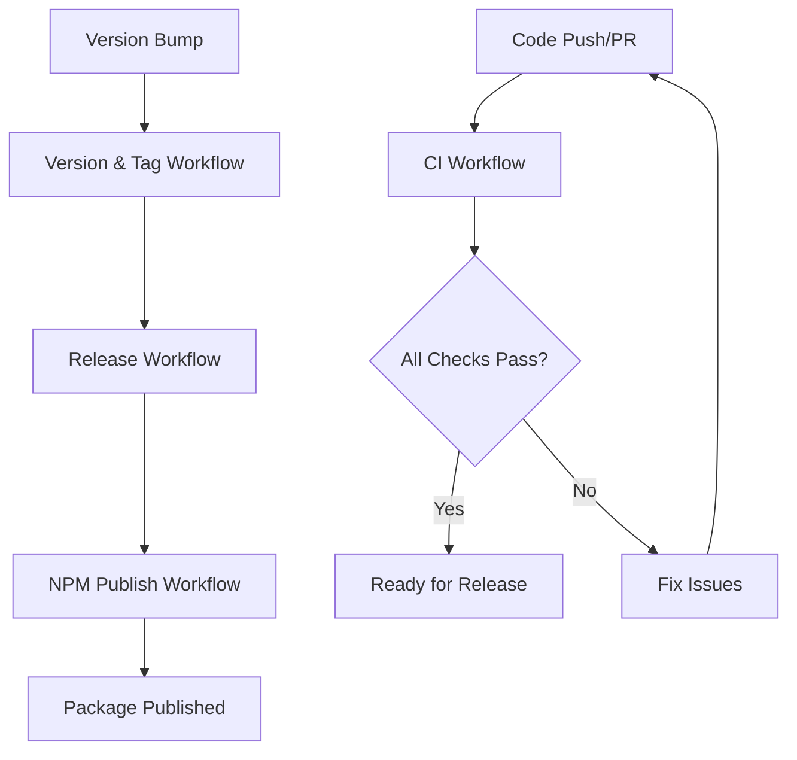

# CI/CD Workflows

This project uses GitHub Actions for continuous integration and deployment. The workflows are designed to ensure code quality, automate releases, and publish packages to NPM.

## Workflows Overview

### 1. CI (Continuous Integration) - `test.yml`

**Triggers:**
- Push to `main` branch
- Pull requests to `main` branch
- Manual trigger via `workflow_dispatch`

**Jobs:**
- **Lint**: Runs ESLint and Prettier checks
- **Test**: Runs tests across multiple OS/Node.js combinations
- **Build and Pack**: Builds the CLI and tests packaging

**Matrix Strategy:**
- OS: Ubuntu, Windows, macOS
- Node.js: 18.x, 20.x, latest

### 2. Release - `onPushToMain.yml`

**Triggers:**
- Push of version tags (`v*.*.*`)
- Manual trigger with version input

**Jobs:**
- **Validate**: Checks version format and release existence
- **Build**: Builds, tests, and packs the CLI
- **Release**: Creates GitHub release with generated changelog

**Features:**
- Automatic changelog generation from git commits
- Artifact uploads (npm package tarball)
- Prerelease detection based on version format

### 3. Publish to NPM - `onRelease.yml`

**Triggers:**
- GitHub release published
- Manual trigger with tag input

**Jobs:**
- **Publish**: Publishes package to NPM with comprehensive validation

**Features:**
- Version validation against Git tags
- Duplicate publication prevention
- Prerelease tag handling (`next` for prereleases, `latest` for stable)
- Post-publish verification

### 4. Version and Tag - `version-and-tag.yml`

**Triggers:**
- Push to `main` with `package.json` changes
- Manual trigger with version bump options

**Jobs:**
- **Check Version Change**: Detects version changes in commits
- **Bump Version**: Automated version bumping (manual trigger)
- **Create Tag**: Creates and pushes Git tags

**Version Types:**
- `patch`: Bug fixes (1.0.0 → 1.0.1)
- `minor`: New features (1.0.0 → 1.1.0)
- `major`: Breaking changes (1.0.0 → 2.0.0)
- `prerelease`: Pre-release versions (1.0.0 → 1.0.1-alpha.0)

## Setup Requirements

### GitHub Secrets

The following secrets need to be configured in your repository:

| Secret | Description | Required For |
|--------|-------------|--------------|
| `NPM_TOKEN` | NPM authentication token | NPM publishing |
| `CODECOV_TOKEN` | Codecov integration token | Coverage reporting (optional) |

### NPM Token Setup

1. Create an NPM account and log in
2. Generate an automation token: `npm token create --type=automation`
3. Add the token to GitHub repository secrets as `NPM_TOKEN`

### Environment Protection (Recommended)

For added security, configure an `npm-publish` environment in your repository settings:

1. Go to Repository Settings → Environments
2. Create environment named `npm-publish`
3. Add protection rules:
   - Required reviewers for manual approvals
   - Deployment branches (only `main`)

## Usage Examples

### Release Process

#### Option 1: Manual Version Bump and Release
```bash
# Bump version locally
npm version patch  # or minor, major, prerelease

# Push changes (triggers version-and-tag workflow)
git push origin main

# This automatically:
# 1. Creates a Git tag
# 2. Triggers release workflow
# 3. Publishes to NPM
```

#### Option 2: Automated Version Bump
1. Go to Actions → Version and Tag → Run workflow
2. Select version type (patch/minor/major/prerelease)
3. The workflow will:
   - Bump version in `package.json`
   - Commit changes
   - Create Git tag
   - Trigger release process

#### Option 3: Manual Release Creation
1. Go to Actions → Release → Run workflow
2. Enter version (e.g., "1.2.3")
3. Creates GitHub release and triggers NPM publish

### Development Workflow

1. **Feature Development**
   - Create feature branch
   - Make changes
   - Open PR → Triggers CI workflow

2. **Code Review**
   - CI must pass (lint, tests, build)
   - Review and approve PR

3. **Merge to Main**
   - Merge PR → Triggers CI on main
   - Ready for release

4. **Release**
   - Bump version (manual or automated)
   - Automatic tag creation
   - Automatic GitHub release
   - Automatic NPM publish

## Workflow Dependencies



## Debugging Common Issues

### CI Failures
- Check lint errors: `npm run lint`
- Run tests locally: `npm test`
- Verify build: `npm run build`

### Release Issues
- Ensure version follows semantic versioning
- Check if tag already exists
- Verify GitHub token permissions

### NPM Publish Issues
- Verify NPM_TOKEN is valid
- Check package name availability
- Ensure version isn't already published

## Best Practices

1. **Version Bumping**
   - Use semantic versioning
   - Update CHANGELOG.md when needed
   - Test locally before releasing

2. **Security**
   - Keep tokens secure and rotated
   - Use environment protection for NPM publishing
   - Review all PRs before merging

3. **Testing**
   - Maintain good test coverage
   - Test CLI functionality manually
   - Verify cross-platform compatibility

4. **Documentation**
   - Keep README.md updated
   - Document breaking changes
   - Update CLI help text as needed
